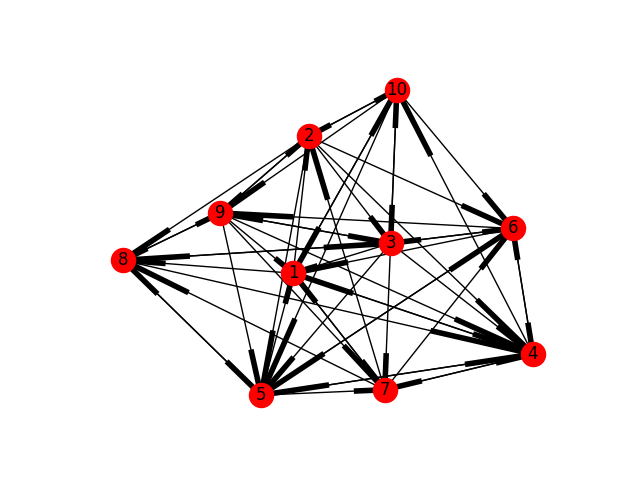

# my_experiment
- these codes are reimplemented from the papers that writen by Heath J. LeBlanc and so on
## 1.CheckRobustness.py
- the input file is data/data3.in
- this algo has implemented how to judge the robustness of a network

## 2.consensus_algo.py
- superclass: NetworkAlgo
- subclass: ArcpAlgo
- subclass: LcpAlgo(ToDo)
- subclass: RarcpAlgo(ToDo)
- subclass: MedianConsensusAlgo(Todo)

## 3.old_codes
- this directory includes the codes I wrote before, 
because the structure of the Graph(or network) is not the same so I decide to rewrite :-(

## 4.tranin_data_generate.py
- how i generate the data and the results are in data dir(r_1_train_data.csv...)
