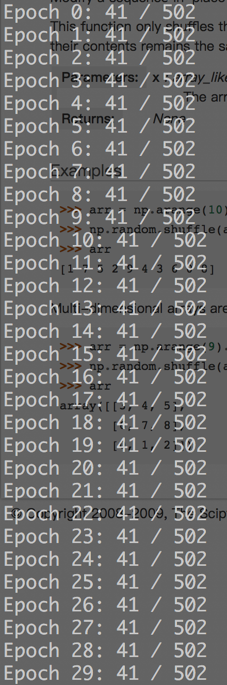

```   
    |——
                                      ___.                   __   
        _______          _______  ____\_ |__  __ __  _______/  |_ 
        \_  __ \  ______ \_  __ \/  _ \| __ \|  |  \/  ___/\   __\
         |  | \/ /_____/  |  | \(  <_> ) \_\ \  |  /\___ \  |  |  
         |__|             |__|   \____/|___  /____//____  > |__|  
                                           \/           \/        
                                                                    ——|
                                               
                                               -- 数据生成实验报告
```

## 目标
- r-rboust的训练数据各10000个
```
    r = 5， 10000
    r = 4， 10000
    r = 3， 10000
    r = 2， 10000
    r = 1， 10000
```
- 确定距离函数，计算精确度
    * 预测值离开正确值的偏差
    
## 实验过程
- 解决图的随机生成
    * 确保图为有向无环图，参考了[[1]](##reference)中的代码
    * 优化算法时引发的思考：
        + r-robust和连通性的关系，强连通图的(r，s)-robust是否为最大：
            
            实验了下，顶点数为10的强连通图为(5, 10)-robust
            
        + (r, s)-robustness的定义依然没有很好的理解，s的取值到底如何限定：
        
            按照文献[[2]](##reference)中对于(r, s)-robustness的定义,s的上限即为顶点数。
            再通过剖析文献[[3]](##reference)中的robust_holds算法可以知道,(r, s)-robustness
            中的s可以大于子集中的顶点数。
            
        + (r, 0)-robustness是否存在：
            
            可以说这对于任意(r, s)-robustness都成立。但是已知当r>=1时，通过[[3]](##reference)中
            算法产生的s一定是>=1的。
           
    * 随机生成的图是否有重复: 
        
        通过判断adjmartix是否存在于预先定义好的list里进行去重复，我总担心内存会爆掉不过生成1000个数据倒是没什么问题。
    
- 神经网络的输出问题
    * 0-robust问题（最后结论：输出中将不包含r=0或s=0的组合）
        + 0-robust: 
            
            根据文献[[2]](##reference)中对于r-robustness的定义，作者提到可以称只包含一个节点的图为0-robust或者1-robust(?)
        
        + 一个含有2个或2个以上节点的图是否一定满足(1, 1)-robustness:
        
            一定满足。
            - 先证明s。如果s满足不了>=1，那么s=0。那么根据假设以及(r, s)-robustness的定义,|S1|+|S2|<=0, 这与r=1满足
            相互矛盾。
            - 再证明r。如果r满足不了>=1，那么这个图是不连通的。
           
        + (0, s)-robust:
            任意的图都能够满足这个条件，且s的取值是固定的，即为顶点数。
        
- 实验数据
    * 随机生成1000个(5, s)-robust数据(train_X, train_Y), 用时3012.520567s, 数据中不包含(5, 9)-robust和(5, 10)-robust 
    * 随机生成1002个(4, s)-robust数据(train_X, train_Y), 用时2816.266050s, 数据中不包含(4, 9)-robust和(4, 10)-robust
    * 随机生成(3, s)-robust、(2, s)-robust、(1, s)-robust数据各1000个, (train_X, train_Y), 用时共3085.257895s，数据中不包含
    (1, 9)-robust, (2, 8)-robust, (2, 9)-robust, (2, 10)-robust, (3, 8)-robust, (3, 9)-robust, (3, 10)-robust
    
    
- 实验设置和结果
    * 神经网络架构:100 -> 150 -> 120 -> 50(输入包含100个节点，隐藏层一包含200个节点，隐藏层二包含150个节点，输出层50个节点)，尝试了其他
    架构(100,200,50)也能出现相似的结果。
    * backpropagation中采用梯度下降法，学习率为0.7，epoch30次，训练集4500，预测集502
    * 实验结果：
        
        
      

- 结论和后续计划
    
    生成10000的数据量跑的时间可能会有些久，所以直接就生成1000的数据量，发现结果并不理想，尝试过别的神经网络架构（只改变隐藏层数和节点数），发现结果变化不大（同样的差或者同样的好），而且有时候相同的参数训练结果也会不同。后续打算，重新规划数据集打算扔到tensorflow上做实验。tensorflow提供了别的loss func
    方便实验而且能够保存模型参数。
    
    
    
## reference
- [1] [有向无环图的生成](http://blog.csdn.net/zhoujinyu0713/article/details/10163037)
- [2] LeBlanc H J, Zhang H, Koutsoukos X, et al. Resilient asymptotic consensus in robust networks[J]. IEEE Journal on Selected Areas in Communications, 2013, 31(4): 766-781.
- [3] LeBlanc H J, Koutsoukos X D. Algorithms for determining network robustness[C]//Proceedings of the 2nd ACM international conference on High confidence networked systems. ACM, 2013: 57-64.